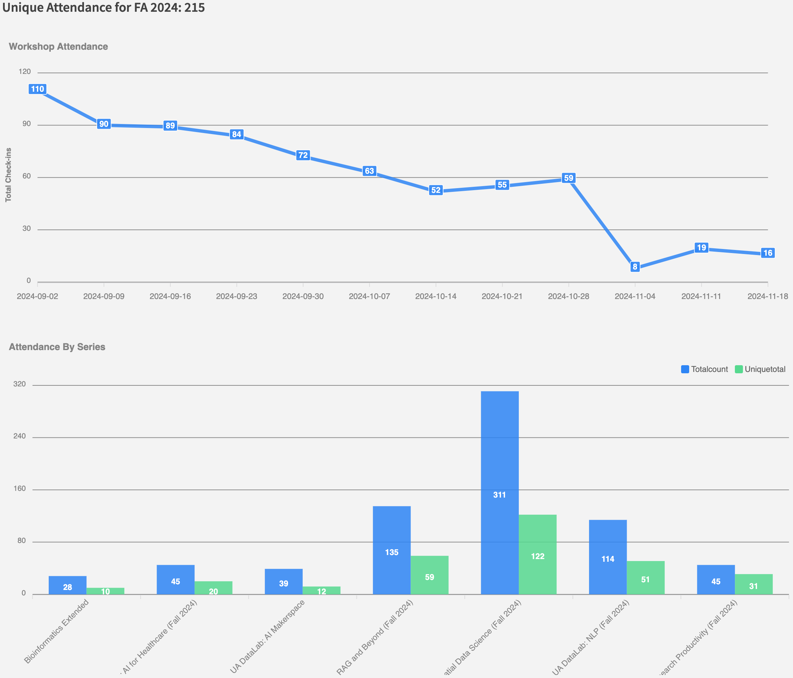

<!-- PROJECT LOGO -->
<br />
<div align="center">
  <a href="https://datascience.arizona.edu/">
    
  </a>

  <h1 align="center">Data Science Institute Metrics System</h1>
</div>

Documentation Created by Austin Medina, May 2024. Updated by Jeff Gillan, Nov. 2024 and April 2025.

<details>
  <summary>Table of Contents</summary>
  <ol>
    <li><a href="#about-the-project">About The Project</a></li>
    <li><a href="#software-architecture">Software Architecture</a></li>
    <ul>
        <li><a href="#system-overview">System Overview</a></li>
        <li><a href="#database-schema">Database Schema</a></li>
    </ul>
    <li><a href="#dsi-metrics-how-to">DSI Metrics How-To</a></li>
      <ul>
        <li><a href="#first-time-access">First Time Access</a></li>
        <li><a href="#accessing-metrics">Accessing Metrics</a></li>
        <li><a href="#exporting-recontact-list">Exporting Recontact List</a></li>
        <li><a href="#series-walkthrough">Series Walkthrough</a></li>
        <ul>
          <li><a href="#adding-a-series">Adding A Series</a></li>
          <li><a href="#modifying-a-series">Modifying A Series</a></li>
          <li><a href="#deleting-a-series">Deleting A Series</a></li>
        </ul>
        <li><a href="#workshops-walkthrough">Workshops Walkthrough</a></li>
        <ul>
          <li><a href="#adding-a-workshop">Adding A Workshop</a></li>
          <li><a href="#modifying-a-workshop">Modifying A Workshop</a></li>
          <li><a href="#deleting-a-workshop">Deleting A Workshop</a></li>
        </ul>
        <li><a href="#users-walkthrough">Users Walkthrough</a></li>
        <ul>
          <li><a href="#adding-a-new-user">Adding A New User</a></li>
          <li><a href="#deleting-a-user">Deleting A User</a></li>
          <li><a href="#authorizing-a-zoom-meeting-id">Authorizing A Zoom Meeting ID</a></li>
        </ul>
        <li><a href="#qualtrics-walkthrough">Qualtrics Walkthrough</a></li>
        <ul>
          <li><a href="#creating-a-new-qualtrics-form">Creating A New Qualtrics Form</a></li>
          <li><a href="#modifying-qualtrics-form-id">Modifying Qualtrics Form ID</a></li>
          <li><a href="#switching-owner-of-qualtrics-api-key">Switching Owner Of Qualtrics API Key</a></li>
        </ul>
        <li><a href="#switching-zoom-api-owner">Switching Zoom API Owner</a></li>
      </ul>
    <li><a href="#repository-breakdown">Repository Breakdown</a></li>
    <li><a href="#system-restart">System Restart</a></li>
    <li><a href="#future-improvements">Future Improvements</a></li>
  </ol>
</details>

<!-- ABOUT THE PROJECT -->
## About The Project
Data Science Institute (DSI) Metrics (https://dsi-metrics.cyverse.org) is a software architecture that displays registrations and attendence of DSI educational workshops. It can automatically (and manually) fetch registration data from Qualtrics and attendance information from Zoom and upload into a Postgres database. The system offers front-end CRUD (create, read, update, delete) and visualization tools hosted using Budibase, allowing authorized users to interact directly with the database. The system is hosted on a virtual machine on the [Cyverse](https://cyverse.org/) network. Access to the system is restricted to authorized users due to University and FERPA regulations. Authorized users must be on the Uarizona network (or vpn) to access the visualization website at https://dsi-metrics.cyverse.org.

<br>

<a href="">
  
</a>


### Quick Links
* [DSI Metrics System](https://dsi-metrics.cyverse.org)
* [Zoom API authorization](https://cerberus.cyverse.org)

<p align="right">(<a href="#readme-top">back to top</a>)</p>

## Software Architecture
### System Overview
<a href="https://datascience.arizona.edu/">
  
</a>

## Repository Breakdown

This repository (https://github.com/cyverse/DSImetrics) is cloned onto the Cyverse production server (cerberus) but it is called `DataLabMetrtics` for some reason. It should probably be changed to `DSImetrics` but I'm afraid things will break. 

The repository consists of the following directories:
* **budibaseDocker** - Holds the `docker-compose.yml` which launches a series of docker images for the Budibase website along with all other supporting files for Budibase to function. The docker container is what people access when they access the DSI Metrics website. https://dsi-metrics.cyverse.org
* **initialUploads** - Single run scripts used to reinitialize the database with data manually grabbed from Spring 2024. Also contains Zoom attendance data that was manually downloaded. 
  * **initialZoomUpload_sp24.py** - script that will crawl over CSV files from Spring 2024 and add the data to the postgresql database.
  * **initialZoomUpload_f24.py** -script that will crawl over CSV files from Fall 2024 and add the data to the postgresql database. There are slight differences in colum titles which makes it necessary to have a different scripts from Fall and Spring 2024. 
* **postgreSQLScripts** - Used in initial uploads to create functions used in the system and create the tables used in the database. Also includes common queries used in Budibase visualizations
* **productionScripts** - Scripts that are automatically run by crontab on Linux. These scripts are responsible for the main automation of the system including fetching qualities and zoom data and listening from new series to be entered through Budibase
  * **zoomProcessAttendance.py** - this script is set to run automatically every hour on the 30 minute. It reaches out to the Zoom API and looks for the most recent Zoom meeting and pulls that data into the Postgresql database
  * **seriesProcessing.py** - This script will scrape html text from a user defined URL that has information on DSI workshop series. (e.g., https://datascience.arizona.edu/events/navigating-world-data-engineering). It will add the information to the postgresql database. This script is called from the `seriesListener.py` script that is run nightly.
  * **seriesListern.py** - When new series is added to the Budibase website, the listener gets a notification that a new series has been added. It then triggers the `seriesProcessing.py` script which goes to the DSI webstie url and scrapes workshop sessions for the series and populates it into the `workshops` table in the postgres database. The script is run nightly at 2am. 
  * **qualtricsDataProcessing.py** - The script runs automatically by crontab every hour on minute ten. It reaches out to Qualtrics API and pulls down workshop registration data and adds it to the postgresql database. 
* **readMeImages** - The images used in this README
* **unitTesting** - Initial testing and exploration code when first creating this system. Kept in the repo for future developers to use as a reference
* **zoomApp** - Holds the files for a Flask app which allows a user to authorize the system to access their Zoom meeting information and then prompts the user to enter the Zoom meeting IDs they wish the system to access. The server is whats accessed from cerberus.cyverse.org
* **linuxSystemFiles** - Contains the files run on the Linux system such as the CronJobs, HAProxy file, and a nightly restart script.
  * **nightlySystemRestart.sh** - this shell script is run every night at 2am from the crontab. It reboots the budibase docker container, runs the `seriesListener.py` script and the `zoomOAuth.py` script.
  * **crotab.txt**
  * **HAProxy_config.txt**

<p align="right">(<a href="#readme-top">back to top</a>)</p>

<br/>
<br/>

## Website and Database Hosting

DSI-metric website (budibase), postgresql database, and all scripts are hosted on a Cyverse VM. This respository is synced to that VM. To access the VM, you need to be added by Andy Edmonds

`ssh -p 1657 <cyverse_user_name>@cerberus.cyverse.org`

You will be prompted for your Cyverse password.

The DSI-metric files are located in `/home/austinmedina/DataLabMetrtics`

<br/>
<br/>

## Crontab

The DSI-metrics system deploys a series of python scripts that fetch registration data from Qualtrics and attendance data from Zoom. These scripts run automatically using crontab. **Currently, Zoom & Qualtrics automatic fetching is disabled**. 

To view a list of cronjobs type the command `sudo crontab -l`

You can edit the crontab with `sudo crontab -e`

The current crojobs are:

 m h  dom mon dow   command
 
30 * * * * /home/austinmedina/DataLabMetrtics/productionScripts/zoomProcessAttendance.py

10 * * * * /home/austinmedina/DataLabMetrtics/productionScripts/qualtricsDataProcessing.py

0 2 * * * /home/austinmedina/DataLabMetrtics/linuxSystemFiles/nightlySystemRestart.sh

`zoomProcessAttendance.py` will run on the 30 of every hour (e.g., 1:30, 2:30, etc)

`qualtricsDataProcessing.py` will run on the 10 of every hour

`nightlySystemRestart.sh`  will run daily at 2:00 AM.

Cronjob script results are logged at /home/austinmedina/DataLabMetrics/logging

Current behavior for `zoomProcessingAttendance.py`: If a workshop is scheduled to occur on a certain date, then the script will execute every hour starting at 12:30 am. The script hits the Zoom API and returns the names of attendees in the Zoom session. This data goes into a Postgresql database. It appears the script is looking for the most recent Zoom meeting to pull data from. 


<br/>
<br/>

## PostgreSQL


### Database Schema
<a href="">
  
</a>


The `registreeinfo` database table contains the names of people that registered (through Qualtrics) and/or attended a workshop (through Zoom). For a person to be put in this table, they have to had provided an email through the Qualtrics registration or Zoom attendance. People are assigned a RegID based on their email. If they don't have an email, they are put into the `unknownpeople` table. The python scripts `qualtricsDataProcessing.py` and `zoomProcessAttendance.py` populate the `registreeinfo` table (and the `unknownpeople` table if no email). 

The `qualtricsDataProcessing.py` reaches out to Qualtrics API and downloads workshop registration data. 

The `zoomProcessAttendance.py` script, reaches out to Zoom API and brings the attendee data into the database. 


The `registreeworkshop` table contains each unique user (RegID) and each of the workshops they either registered for (through Qualtrics) and/or attended (through Zoom). If a user does not have an email, then they are not in this table, they are put in the `unknownpeople` table. 

The `workshops` table contains the name, date, workshopID and seriesID of each workshop session 

The `series` table contains the name of the workshops series and other info like startime, endtime, startdate, enddate, etc.


#### Useful SQL Commands

Connect to sql `sudo psql -U postgres -d DataLab`

List tables in the database `\dt`

See a table's structure `\d registreeinfo`

Fetch all data from a database table `select * from series;`

Return records for an exact matching string `select * from registreeinfo where lastname = 'Chen';`

Select data from a table and show in numerial descending order `select * from registreeworkshops order by workshopid desc;`


<br/>
<br/>


<!-- System Restart -->
### System Restart
If there are any issues accessing the Zoom App or the DSI Metrics page, perform the following steps to relaunch the software:
1. SSH into cyverse vm
2. The following command will stop all python processes
   ```bash
   pkill python
   ```
3. Next stop the docker container running Budibase
   ```bash
   cd budibaseDocker
   docker compose down
   ```
4. Restart the Budibase docker image
   ```bash
   docker compose up
   ```
5. Return to the root directory for the project and start up the Zoom app and Postgres listener
   ```bash
   cd ../
   python productionScripts/seriesListener.py &
   python zoomApp/zoomOAUTH.py
   ```
6. These commands are all run nightly and can be run manually using by running
   ```bash
   /home/austinmedina/DataLabMetrtics/linuxSystemFiles/nightlySystemRestart.sh
   ```
7. Ensure you are on the UofA Wifi or VPN before attempting to access

<br/>
<br/>

## DSI Metrics Front End (Budibase)
### First Time Access
To access the data visualizations available to authorized users, click on the *DSI Metrics System* link in the quick links above. Before you are able to log in, the admin must add your email to the system, generate a random password for you, and give you access to the app as discussed later. When prompted fill out the login with the temporary password. The system will then prompt you to change your password. Ensure to remember your password as this is the one you will use every time you log into the system.


Once your password is reset, you will once more be prompted to log in using your new password. When you click login, you will be prompted to choose the app you want to access. Select DSI Metrics.


### Accessing Metrics
After you click on the app you will be brought to the Metrics Page. On this page, you can select a semester and a year to get attendance information for the selected semester. The first box includes 3 graphs. The first is attendance over time for all workshops in that semester. The second is the total attendance and unique attendance for each workshop in that semester. The unique attendance is for each person who attended a workshop. If someone went to 3 weeks of workshops, they are counted 3 times in the total attendance but not the unique attendance. The final graph is a bar chart for registration information for the semester. The graph breaks down registration into people we were able to identify, not identify, those who registered, those who never attended, etc.


If you scroll down you will find another drop down. This menu lets you select any workshop and will display the attendance over time and the workshop names/topics for each week.


### Exporting Recontact List
This feature is only available on Chrome browsers due to javascript compatibility issues. At the top of the page, if you click 'Export Recontact Contact List' it will bring you to a table of every person who has listed they want to be recontacted on the registration form. By default, if they attend but never register, they are not considered for recontact. Once on this page, the system will automatically download a CSV file containing all of their emails for easy use.


### Series Walkthrough
Definitions: In this software Series are the overarching collection of workshops. Every workshop will be associated with a series, with the ability for multiple workshops to be connected to one series. Having series' allows us to create one-off workshops, or a weekly workshop all a part of a series. Creating a series is the first step for any new workshop, regardless of the number of workshops occurring.

:warning: IMPORTANT PREREQUISITES: BEFORE ANY SERIES CAN BE CREATED THERE MUST BE A QUALTRICS FORM ALREADY CREATED, A ZOOM MEETING ID ASSOCIATED WITH IT, AND A CALANDER PAGE SETUP ON THE DSI WEBSITE. IF NO CALANDER EVENT HAS BEEN CREATED THE WORKSHOPS' WILL NOT BE AUTOMATICALLY CREATED AND YOU WILL HAVE TO MANUALLY ENTER THEM. ANY OF THIS INFORMATION CAN BE CHANGED AT ANY TIME IF NECESSARY.

On the navigation bar click 'Series'. The link will bring you to a page containing a form to create, modify, or delete a series, as well as a table to view all series currently in the system.


#### Adding A Series
To add a series you will need to fill out the corresponding information on the form
* SeriesID - Ignore, this is automatically generated
* SeriesName - The name that will be displayed on all tables. Must match the Qualtrics name
* Zoom Meeting ID - The meeting ID associated with the meeting
* QualtricsID - The Qualtrics survey ID can be found in the edit link for the survey. For example in this link 'https://uarizona.co1.qualtrics.com/survey-builder/SV_d0aMpul3tB1wJ1Q/edit', the surveyID is SV_d0aMpul3tB1wJ1Q
* SeriesURL - The calendar event for the series, for example, 'https://datascience.arizona.edu/events/navigating-world-data-engineering'
* Start Time - The start time of the workshops in the series. If the workshops do not start at the same time they cannot be a part of the series. Select the appropriate AM or PM time and the system will display it in 24 hour time, that's okay.
* End Time - The end time of the workshop, the same rules apply as the start time
* Start Date - The day of the first workshop in the series
* End Date - The day the last workshop in the series occurs
* Semester - Choose between Spring, Summer, Fall, and Winter
* SeriesYear - The year the workshop series is taking place

Once all of the above information has been entered, select 'Save' and the Series will be added to the database. You should be able to see the new entry in the table below the form.


#### Modifying A Series
To modify a series, first go to the table at the bottom and find the SeriesID for the series you wish to modify. Next, enter the SeriesID to the form, this will automatically populate the form except for the start and end time which you will have to enter manually. Finally, once your modifications are complete, click 'Update'. To verify go to the table at the bottom and the changes should be present.

#### Deleting A Series
If you need to remove a series from the database you can easily do so by first going to the table at the bottom and finding the SeriesID for the series you wish to delete. Next, enter the SeriesID into the form. Finally, click 'Delete Series'. You should be able to see the changes reflected in the table.

### Workshops Walkthrough
Definitions: Workshops are the actual events people will be attending, registering, and getting checked in for. The workshops contain the workshop name, id, and date, and will always be associated with a series. The workshops' time information will be stored in the series. Workshops can be created automatically by inserting a series URL when the series is created in Budibase, which will web scrape the 'When' section of the page and create a workshop for every date present. If the URL is not provided or fails, workshops can be entered manually through the 'Workshops' page on Budibase.

:warning: WARNING: IF ANY OF THE WORKSHOPS ARE DELETED IT WILL ALSO DELETE THE ACCOMPANYING CHECK-IN AND REGISTRATION DATA FOR THE WORKSHOP. MODIFY WORKSHOPS CAREFULLY TO ENSURE NO DATA LOSS.

#### Adding A Workshop
1. First travel to the workshops page using the navigation bar at the top of the app.


2. Next click the "+" in the top left corner of the table. This will let you interact directly with the table without the need for a form.
3. Enter the seriesID, workshop name, and workshop date.
4. If you do not know the seriesID, navigate to the series page, scroll to the table at the bottom, and click on the column header for series name. Here you can search for a workshop by name and find its associated ID on the left.


5. Click the "Save" button to save the workshop into the database.


#### Modifying A Workshop
1. Travel to the workshops page using the navigation bar at the top of the app as described in step 1 of [Adding A Workshop](adding-a-workshop).
2. Find the data item you wish to modify by scrolling through the table or clicking on a column header to search for a specific value.


3. Double-click on the cell of the table you wish to modify Note: You cannot modify the workshopID.


4. Modify the contents of the cell as you wish and when done just click away from the table or navigate to a new tab and the information will automatically be updated.


#### Deleting A Workshop
1. Navigate to the workshops page using the navigation bar at the top of the app as described in step 1 of [Adding A Workshop](adding-a-workshop).
2. Find the data item you wish to modify by scrolling through the table or clicking on a column header to search for a specific value.


4. On the left side of the table select the checkbox of the item(s) you wish to delete and click the trash icon. ⚠️ THE ITEM WILL PERMANENTLY BE DELETED AND ALL REGISTRATION AND CHECK-IN DATA WITH IT.


### Users Walkthrough
#### Adding A New User
1. As an admin, traversing to the metrics website will take you to the following page:


3. On this page select the users tab in the top left.
4. On the users page click 'Add users'.


5. Enter the email for the user you wish to add. You can add multiple by clicking '+ Add email'.


6. For each user, select the appropriate access level. Currently, all pages can be accessed by basic users.


8. Once all emails have been added click the blue 'Add users' button.
9. On the onboarding page select 'Generate passwords for each user.


10. Distribute the passwords either by copying them or downloading the CSV.


12. Next navigate back to the apps page and select 'DSI Metrics'.


14. In the top right select 'Users'. If you click the dropdown for each email, you can change their permissions for the DSI Metrics App. You need to select at least "Can use as Basic" for the user to be able to use the app.


16. The user is all set to access the DSI Metrics App.
    
#### Deleting A User
1. To remove a user, navigate to the 'Users' page as an admin.


3. Select the user using the checkbox on the left of the table and on the top right of the table click 'Delete User'.


4. Confirm the deletion by clicking 'Delete' in the popup window and the user will be deleted from the system, and no longer have access to the DSI Metrics website.

#### Authorizing A Zoom Meeting ID
1. While logged into UofA Wifi or the UofA VPN navigate to [Zoom OAUTH](https://cerberus.cyverse.org).
2. Click on the button to allow OAuth.

&emsp;&emsp;


3. This button will redirect you to the Zoom website where you will need to authorize the system to access your Zoom information.
4. Sign into your Zoom account as normal and click 'Allow'.


6. Once you have clicked allow, you will be redirected to a page that will allow you to enter the Zoom Meeting IDs that you have access to, and wish for the software to be able to fetch participants from. These should be the Zoom meeting IDs for series that have already been created.


8. You can enter as many meeting IDs as you wish. Enter them one at a time and click 'Submit' after each.
9. Once done, exit the page and the keys for each meeting ID will be saved into the database.

<br/>
<br/>
<br/>

## Qualtrics Walkthrough
Qualtrics is a survey tool offered through the UofA, that allows us to create simple yet modern forms. The forms used in the DSI Metrics System ask a few simple questions: are you UofA affiliated, first name, last name, email, organization (if not UofA affiliated, which workshops they would like to attend, and if they would like to be recontacted. The system is built around these specific questions so no changes can be made to the form structure or organization. The system uses the Qualtrics ID and a Qualtrics API Key to function.

❗EVERY QUALTRICS FORM THAT IS CREATED MUST BE CREATED AS A COPY OF THE [TEMPLATE](https://uarizona.co1.qualtrics.com/survey-builder/SV_eS9bgBRYRehalEy/edit).
❗EVERY ACTIVE QUALTRICS FORM MUST BE SHARED WITH THE OWNER OF THE API KEY ENTERED INTO THE SYSTEM.

#### Creating A New Qualtrics Form
1. To create a new registration form, create a copy of the template form listed above.
  Note: You must have access permissions to view. For permission to access email tina@arizona.edu or slroberts@arizona.edu.
 ❗DO NOT EDIT THE ORIGINAL. ONLY EDIT A COPY OF THE TEMPLATE
2. Change the name of the form to your desired series name.
3. Do not change any information on the form except for the workshops section.
4. In the workshops section, list the names of the workshops in CHRONOLOGICAL order from earliest to latest starting date. You can include the name and date of the workshop, or just the name (topic) of the workshop.
5. Click 'Publish' in the top right corner to make your survey public and begin collecting responses.
6. Once the workshop has been created it needs to be shared with the owner of the API key currently in the system. Navigate to the projects section of Qualtrics.
7. On the right side click the 3 dots and select 'Collaborate'.
8. Enter the Arizona email for the owner of the API key the system currently uses. See [Switching Owner Of Qualtrics API Key](#switching-owner-of-qualtrics-api-key) if the owner is unknown or out of date.
9. Distribute the survey and wait for responses to be collected in the DSI Metrics System.
Note: The responses will not be collected into the DSI Metrics System until the survey ID is entered in for a series, and the series has started according to its start date.

#### Modifying Qualtrics Form ID
1. [Creating A New Qualtrics Form](#creating-a-new-qualtrics-form) must be completed before this step can take place.
2. Navigate to the edit page of the Qualtrics survey, ex: https://uarizona.co1.qualtrics.com/survey-builder/SV_d0hMpul3tB1wJ1Q/edit
3. In the URL the survey ID is the numbers between "survey-builder/" and "/edit", in this case, "SV_d0hMpul3tB1wJ1Q".
4. Navigate to the [DSI Metrics Website](https://dsi-metrics.cyverse.org/app/dsi-metrics#/series) and using the navigation bar at the top go to the series page.
5. Scroll to the table at the bottom and click on the header for "seriesname". Enter the desired series you wish to add the Qualtrics ID for.


6. Once you find the series you wish to add/change the qualtricsID for make note of the seriesID on the left, the start time, and the end time listed to the right (as these are the only values that will not auto-populate in the form).
7. In the form, enter the seriesID for the series you wish to modify, all fields should populate except for the start and end time, those will need to be entered manually.
8. Enter the new Qualtrics ID and click 'update'.


#### Switching Owner Of Qualtrics API Key
1. If the owner of the Qualtrics API Key needs to be switched the "qualtrics_api_token" variable must be changed in program variables. Note: This variable can only be changed by users with 'Power' privileges and above. At the time of writing only austinmedina@arizona.edu, sarah.cyvserse@gmail.com, and jgillan@arizona.edu have those permissions. The **Qualtrics API Token is currently through the account of Jeffrey Gillan (jgillan@arizona.edu)**
2. Navigate to [Qualtrics User Settings](https://uarizona.co1.qualtrics.com/admin/account-settings-portal/user-settings).

3. Under API click 'Generate Token', generating a new API token and immediately invalidating the old one. For more information on the API key, check the [Qualtrics documentation](https://api.qualtrics.com/2b4ffbd8af74e-api-key-authentication).
4. On the [DSI Metrics Page](dsi-metrics.cyverse.org) when logged in as a 'Power' user or above, navigate to the 'System Variables' section using the navigation bar at the top.
5. Find the cell that says "qualtrics_api_token" and select the cell to the right of it under "elementvalue". Enter the API token from earlier and click anywhere outside the table to save the change.
6. Ensure all active series Qualtrics forms are shared with the owner of the Qualtrics API key, otherwise the system will not be able to access those surveys.

## Switching Zoom API Owner
1. To switch the owner of the Zoom API and Zoom App involves multiple steps and approvals from outside the UofA Data Science Institute.
2. Navigate to the [Zoom Account Settings Page](https://arizona.zoom.us/account) and at the bottom left of the navigation bar under "Admin" select "Account Management" and then "Account Profile".


3. Find your account owner listed on that page. Note: For UofA accounts, it should be malcolm@arizona.edu
4. Send the account owner an email with the subject line: "Requesting Zoom Legacy App Access for Data Science Institute Project".
5. In the body of the message include "I would like to be granted access to create a Legacy Zoom App for the Data Science Institute. One has already been approved for Austin Medina (austinmedina@arizona.edu) but we need to change the ownership of the app. I will be creating the same application, a user-managed app with OAuth, and the meeting:read:list_past_participants scope, just under a new Zoom account."
6. Once you have been approved to create a Zoom App go to the [Zoom Marketplace](https://marketplace.zoom.us/)
7. In the top right-hand corner, select "Develop" and then "Legacy Zoom App". If you cannot select this application, it means you have not been given the proper access.


8. For app type, select O-Auth.


10. Enter the name as "DSI Metrics", select "User-Managed-App", and intend to publish as "No".


12. Copy the Client ID and Client Secret.
13. In a new tab go to the [DSI Metrics Page](dsi-metrics.cyverse.org) when logged in as a 'Power' user or above, and navigate to the 'System Variables' section using the navigation bar at the top.
14. Find the cells that say "zoom_client_id" and "zoom_client_secret" and select the cell to the right of it under "elementvalue". Enter the client ID and client secret in their respective fields and click anywhere outside the table to save the change.
15. For any active series, the owner of those zooms must go back through [Authrozing a Zoom Meeting ID](#authorizing-a-zoom-meeting-id). If this step is not done in its entirety for every currently functioning and future Zoom meeting, the system will not be authorized to pull participants for those Zoom meetings and the attendances will not be updated.
16. Navigating back to the Zoom Marketplace where you received your client keys, enter the "Redirect URL For OAuth" as: https://cerberus.cyverse.org/getAccess
17. Fill out the rest of the page as shown:


  
19. Fill out the information page as shown below:


21. In the "Developer Contact Information" section of the "Information" page, enter your name and your Arizona email that was given access to the Zoom legacy app.
22. Ignore the "Feature" page and navigate to the "Scopes" page. On this page click "+ Add Scopes" and search for meeting:read:list_past_participants, then click done.


24. On the "Activation" page where it says "Add URL" copy the URL listed.
25. On the virtual machine hosting the DSI Metrics System navigate to zoomApp/templates/credentials.html. On this page at the bottom on line 37 replace the URL with the URL you just copied:


27. With that everything should be updated for the Zoom App to be working. Verify by going to the [Zoom OAuth App](https://cerberus.cyverse.org) and going through the process of giving the app access to your account and then entering in a meetingID.

<br/>
<br/>
<br/>


### Future Improvements
- [ ] UofA Net ID Integration
- [ ] More robust logging
- [ ] Only store the last 5 days of logging files
- [ ] More robust error handling
- [ ] Rewrite Qualtrics and Zoom API Code for efficiency
- [ ] More graphs and metrics in Budibase
- [ ] Improve overall system security


